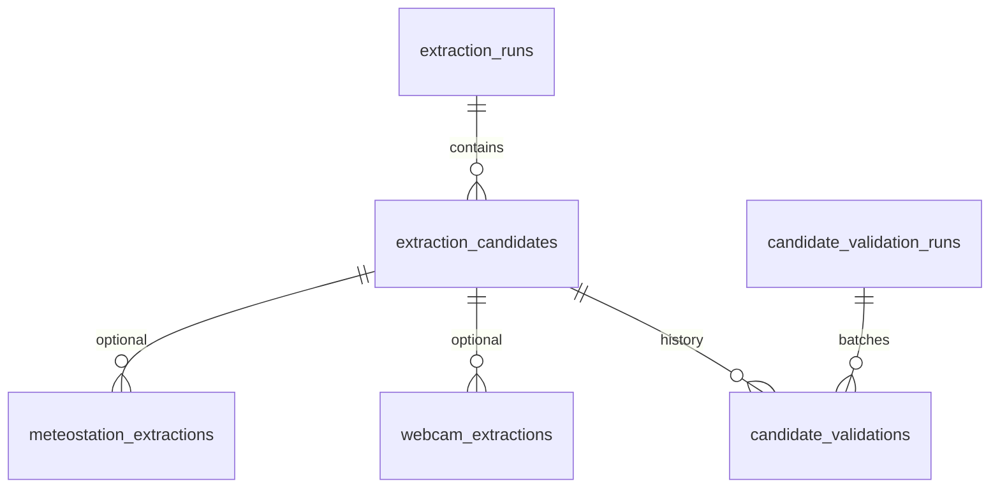

# Ground Crew CLI

Utilities for ingesting and managing candidate retrieval and validation runs.

## Database model

All tables live in PostgreSQL schema **`glideator_ground_crew`**. Canonical DDL: [`sql/db_schema_glideator_ground_crew.sql`](sql/db_schema_glideator_ground_crew.sql).

**Join key to the rest of Glideator:** `extraction_runs.site_id` matches `sites.site_id` / `glideator_mart.dim_sites.site_id` (integer). Nothing else in this schema references the core app tables.



| Table | Role |
|--------|------|
| **`extraction_runs`** | One row per agent/human extraction for a site. Stores LLM usage/cost, `candidate_count`, `extracted_at`. |
| **`extraction_candidates`** | URLs discovered in that run (`name`, `url`, `host`) plus evidence booleans from the retrieval agent (`takeoff_landing_areas`, `rules`, `fees`, `access`, `meteostation`, `webcams`). |
| **`candidate_validation_runs`** | Metadata for a batch validation (CLI/schedule), optional `filters` JSON. |
| **`candidate_validations`** | **Append-only** checks of a candidate URL (Playwright or manual): `status` (`ok`, `redirected`, `blocked`, `timeout`, `error`, …), `http_status`, `final_url`, `latency_ms`. Latest row per `candidate_id` is used for filtering. |
| **`webcam_extractions`** | Output of `WebcamExtractorAgent`: `found`, `webcam_url`, optional usage fields. Multiple rows per candidate allowed (re-runs). |
| **`meteostation_extractions`** | Same pattern for `MeteostationExtractorAgent` and `meteostation_url`. |

**Legacy note:** older databases may still have `extraction_runs.timestamp` instead of `extracted_at`; rename to align with loaders (see comment at top of the SQL file).

## Commands

- `ground-crew load-jsonl <path>` loads a JSONL file of completed runs into the mart.
- `ground-crew load-single <path>` loads a single JSON payload.
- `ground-crew manual-run` lets you enter a run interactively.
- `ground-crew candidate-run` executes the BrowserUse `CandidateRetrievalAgent` end‑to‑end and writes a JSONL file (defaults to `outputs/candidate_retrieval_results.jsonl`).
- `ground-crew candidate-validate` replays candidates through a real browser, stores append-only validation rows, and (optionally) emits a JSONL artifact.
- `ground-crew candidate-validate-manual` records a manual decision for an existing candidate_id (handy after reviewing a link yourself).
- `ground-crew webcam-run` runs the `WebcamExtractorAgent` on candidates flagged with webcam evidence, extracts actual webcam URLs, and persists results.
- `ground-crew meteostation-run` runs the `MeteostationExtractorAgent` on candidates flagged with meteostation evidence, extracts actual meteostation URLs, and persists results.
- `ground-crew export-resources` exports per-site data for the app: latest extraction run per site, validated candidate URLs, and webcam/meteostation links (deduped, newest first).

### Export resources (for Glideator app / backups)

Picks the **most recent extraction run that still has at least one** candidate whose latest validation is `ok` or `redirected`. (If you add a newer manual/test run whose candidates all fail validation, the export still uses the previous good run instead of exporting an empty site.) If every run is “bad”, falls back to the latest run. Local links are candidates from the chosen run with `ok`/`redirected`. Webcam/meteostation URLs come from successful extractions for those candidates, ordered by `extracted_at` (newest first).

```
poetry run ground-crew export-resources -o outputs/site_resources.json
poetry run ground-crew export-resources --jsonl -o outputs/site_resources.jsonl
poetry run ground-crew export-resources -s 1 -s 2 -o outputs/sample.json
```

Copy the export to **`backend/app/data/site_resources.json`** so the API loads it with the rest of the packaged data (see `backend/README.md`). Optional: `SITE_RESOURCES_JSON_PATH` for a custom path.

### Candidate Runner Options

```
poetry run ground-crew candidate-run \
  --site-id 1 --site-id 2 \
  --limit 1 \
  --output outputs/candidate_retrieval_results.jsonl
```

- `--site-id` can be repeated to target specific sites.
- `--limit` caps the number of rows processed after all filters are applied.
- `--output` selects the JSONL destination; results stay compatible with `load_extraction_run`.

## Smoke Test

1. Ensure `.env` has the required `DB_*` credentials, run `playwright install chromium`, and apply the updated schema in `sql/db_schema_glideator_ground_crew.sql` (new `candidate_validation_runs` + `candidate_validations` tables).
2. Generate data: `poetry run ground-crew candidate-run --site-id 1 --limit 1 --output outputs/test_run.jsonl`.
3. Load a couple of rows: `poetry run ground-crew load-jsonl outputs/test_run.jsonl`.
4. Validate them automatically:

```
poetry run ground-crew candidate-validate \
  --site-id 1 \
  --limit 2 \
  --output outputs/validation_results.jsonl
```

5. Inspect `outputs/validation_results.jsonl` and confirm new rows exist in `glideator_ground_crew.candidate_validations`.
6. Try a manual entry: `poetry run ground-crew candidate-validate-manual --candidate-id <id>` and verify the appended row in the same table.

### Webcam & Meteostation Extraction Options

```
poetry run ground-crew webcam-run \
  --site-id 1 --site-id 2 \
  --limit 5 \
  --output outputs/webcam_results.jsonl
```

```
poetry run ground-crew meteostation-run \
  --site-id 1 \
  --limit 5 \
  --output outputs/meteostation_results.jsonl
```

- `--candidate-id/-c` and `--site-id/-s` narrow the batch.
- `--limit` caps the number of candidates processed.
- `--only-unextracted/--no-only-unextracted` (default: on) skips candidates that already have an extraction record.
- `--include-unvalidated` also processes candidates that haven't been browser-validated as ok/redirected yet.
- `--output` writes JSONL rows with the extraction results.

Both commands only target candidates whose evidence flags (`webcams` or `meteostation`) are `true`, and by default only those with a passing validation status.

## Validation Filters & Options

```
poetry run ground-crew candidate-validate \
  --only-unvalidated \
  --retry-failed \
  --host example.com \
  --validated-by NightlyCheck \
  --timeout-ms 20000 \
  --no-headless
```

- `--candidate-id/-c` or `--site-id/-s` narrow the batch.
- `--only-unvalidated` picks candidates with zero historical validations.
- `--retry-failed` selects links whose latest validation was not `ok`.
- `--output` writes JSONL rows containing the candidate record plus the validation payload (matching what gets persisted).
- `--validated-by` labels who/what performed the check so you can differentiate manual vs. automated runs later.
- Browser settings (timeout/headless) mirror the Playwright-backed validator in `ground_crew/validation/browser_check.py`.


