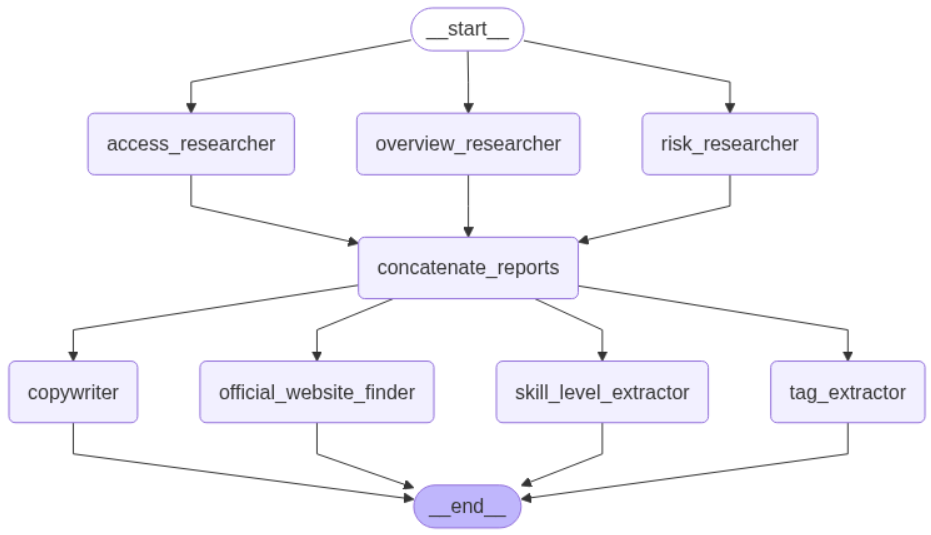

# 📍 Site Researcher

The **Site Researcher** is an autonomous agent that enriches the Glideator database with up-to-date, structured information about paragliding launch sites.

It performs three high-level tasks for every site in the mart:

1. **Research** – queries the web (via Google Search) and Gemini 2.5 models to gather an overview, access details and potential risks.
2. **Extraction & Structuring** – distils the raw reports into machine-readable fields such as skill level, tags and official website URLs.
3. **Copy-writing** – produces an HTML description suitable for the customer-facing web app.

The final result is written to a **JSON Lines** file (`*.jsonl`), one record per site.

---

## Folder Structure
```
site_researcher/
├── run_agent.py               # CLI entry-point – loops over all sites in the DB
├── requirements.txt           # Python dependencies
├── src/
│   ├── agents.py              # LangGraph definition
│   ├── nodes.py               # Individual LangGraph nodes
│   ├── prompts.py             # Prompt templates (Gemini)
│   ├── schemas.py             # Pydantic schemas for validation
│   └── utils.py               # Small helpers
└── README.md                  # ← you are here
```

---

## Quick Start

### 1. Clone & Install
```bash
# in the root of the Glideator repo
python -m venv .venv
source .venv/bin/activate  # Windows: .venv\Scripts\activate
pip install -r agents/site_researcher/requirements.txt
```

### 2. Create a `.env` file
The agent relies on environment variables for both Postgres and Google Generative AI:

```ini
# .env (place next to run_agent.py or export system-wide)
# Postgres connection used to pull the list of sites
db_user=
DB_PASSWORD=
DB_HOST=
DB_PORT=
DB_NAME=

# Google Generative AI – get one at https://aistudio.google.com/app/apikey
GOOGLE_API_KEY=
```

### 3. Run the agent
```bash
python agents/site_researcher/run_agent.py \
       --output my_sites_info.jsonl   # optional, overrides env var
```

Progress for each site is streamed to the console; output accumulates incrementally so you can safely interrupt & resume – already-processed sites will remain in the file.

---

## Output Schema
Each line of the resulting `*.jsonl` file is a UTF-8 encoded JSON object.

| Field | Type | Description |
|-------|------|-------------|
| `site_id` | int | Primary key from `glideator_mart.dim_sites` |
| `site_name` | str | Human-readable name |
| `country` | str | ISO country code |
| `tags` | list[str] | Keywords such as _thermic_, _XC_, _soaring_… |
| `skill_level` | "Beginner"\|"Intermediate"\|"Expert" | Minimum recommended pilot level |
| `skill_level_description` | str | Rationale provided by Gemini |
| `official_websites` | list[{url:str, description:str}] | Verified links about the site |
| `description` | dict | HTML string(s) ready for the front-end |

---

## Architecture

The agent is implemented with [LangGraph](https://github.com/langchain-ai/langgraph), a thin orchestration layer on top of LLM calls.



**Node cheat-sheet:**

* **Overview Researcher** – Generates a general introduction to the site.
* **Access Researcher** – Finds directions, parking and transport info.
* **Risk Researcher** – Highlights dangers (airspace, terrain, meteo).
* **Concatenate Reports** – Merges the three research texts.
* **Tag Extractor** – Produces keyword list for quick filtering.
* **Skill-Level Extractor** – Classifies minimum pilot proficiency.
* **Official Website Finder** – Retrieves authoritative URLs.
* **Copywriter** – Crafts HTML snippet for the front-end.

---

## Customisation

* **Prompt Tuning** – adjust wording in `src/prompts.py`.
* **LLM Parameters** – node temperature, model or tools live inside `src/nodes.py`.

---

## Troubleshooting

1. **Empty responses / `EmptyResponseError`** – Gemini occasionally returns an empty string. The node will raise and retry.
2. **`google.api_core.errors.PermissionDenied`** – ensure your Google API key has the Generative AI API enabled.
3. **Database connection errors** – double-check the `.env` values and connectivity to Postgres.
4. **UnicodeEncodeError when writing** – the script opens the file with `utf-8`; use compatible terminals / shells.
